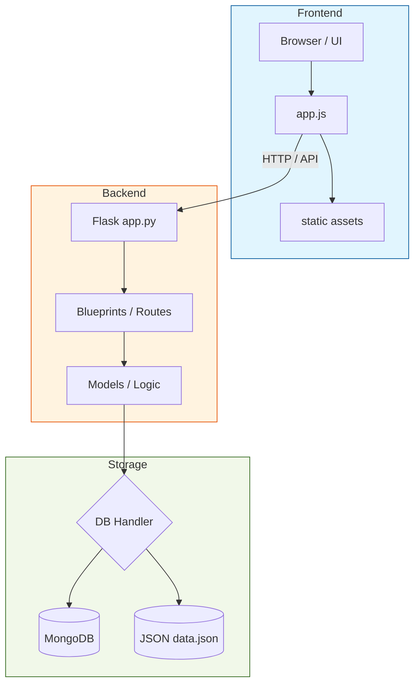
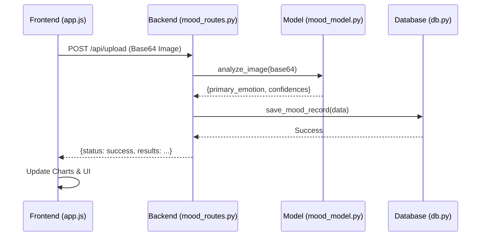

# 🏗️ NeuroLearn Architecture

This document describes the high-level architecture and data flow of the NeuroLearn application.

---

## 🏛️ System Overview

NeuroLearn follows a standard **Client-Server-Database** architecture. It is designed to be lightweight, with a Flask backend serving as a bridge between the frontend and the data storage.

---

## 📂 Core Components

### 1. Frontend (`/frontend`)
- **`index.html`**: The single-page shell of the application.
- **`static/js/app.js`**: Contains all frontend logic, including routing (client-side), API calls, and UI updates.
- **`static/css/style.css`**: Main stylesheet for styling and responsive design.

### 2. Backend (`/backend`)
- **`app.py`**: The main entry point. Sets up the Flask app, registers blueprints, and serves static files.
- **`routes/`**: Grouped API endpoints for Modular development:
    - `mood_routes.py`: Handles image uploads and mood detection history.
    - `activity_routes.py`: Manages education progress and quiz results.
    - `auth_routes.py`: Handles parent/admin authentication.
- **`models/mood_model.py`**: Contains the logic for analyzing emotions from images (currently uses a mock model, but can be replaced with ML).
- **`database/db.py`**: A hybrid database handler. It attempts to connect to MongoDB and falls back to a local `data.json` file if the connection fails.

---

## 🔄 Key Data Flows

### Mood Detection
When a user uploads an image or uses the webcam to detect their mood:

---

## 🔌 API Endpoints Summary

| Feature | Method | Endpoint | Use Case |
| :--- | :--- | :--- | :--- |
| **Auth** | POST | `/api/auth/login` | Login for Parent Panel |
| **Mood** | POST | `/api/upload` | Process image for emotion |
| **Mood** | GET | `/api/history` | Fetch historical mood data |
| **Activity** | GET | `/api/activities` | Get current learning status |
| **Activity** | POST | `/api/activities/save` | Records quiz results |
| **Health** | GET | `/api/health` | Backend status check |
